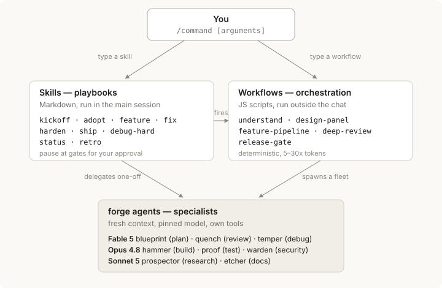

# Command Guide — how skills, workflows, and agents interlock

The harness exposes everything as `/commands`, but three mechanically different
building blocks sit behind them. Knowing which is which tells you what a command
costs, where it runs, and when you'll be asked for input.

## The three building blocks

**Skills** (`.claude/skills/<name>/SKILL.md`) are markdown playbooks. Typing
`/kickoff a recipe app` injects the SKILL.md into your running session
(`$ARGUMENTS` replaced by your text); the main-session Claude then follows the
script — interviews you, runs commands, delegates, and pauses at defined gates for
your approval. A skill keeps your full conversation context; it is choreography,
not a program.

**Agents** (`.claude/agents/forge-*.md`) are not commands — they are the
specialists skills delegate to. Each has its own system prompt, tool allowlist, and
pinned model, and starts with a **fresh, empty context**: it sees only the brief it
is handed. That is deliberate — `forge-quench` judges a diff without seeing the
builder's reasoning, so it can't be pulled into the builder's blind spots.
Blueprint, quench, temper, and warden (planner, reviewer, debugger, security) carry
persistent memory (`.claude/agent-memory/`) and get sharper across projects.

**Workflows** (`.claude/workflows/<name>.js`) are JavaScript scripts the runtime
executes *outside* the chat. The code decides deterministically which agents start
when (parallel / pipelined), on which model, at which effort, with which output
schema — and what happens to the results (dedup, refuter voting, fail-closed
verdicts). Orchestration is code, therefore reproducible.

## Two worked examples

**`/feature F2` — a skill conducting agents.** The playbook anchors the goal (read
the spec, run the suite), sizes the work, then: small → the session builds it
itself; medium+ → plan and done-criteria go to `forge-hammer` (Opus,
tests-first on a branch), the resulting diff goes to `forge-quench` (Fable, fresh
context). Only after confirmed findings are fixed does it merge and tick
PROGRESS.md — with pasted evidence.

**`/ship v0.1.0` — a skill firing a workflow.** The playbook first writes the
release commit (CHANGELOG, version bump), then invokes the `release-gate` workflow:
six gate agents (three inspecting in parallel, then tests → build → runtime smoke
sequentially), aggregated fail-closed — a gate that doesn't report blocks. The
SHIP/NO-SHIP verdict returns to your session, where the playbook walks the manual
checklist with you before tag and deploy.

One line: **skills orchestrate *with you* in context; workflows orchestrate
*without you* in breadth** — and skills are the bridge that fires workflows at the
right moment.

## When to use what

| Situation | Command | Kind |
|---|---|---|
| New product idea | `/kickoff <idea>` | Skill (interviews you) |
| Existing repo to bring in | `/adopt <path>` | Skill |
| Build one feature | `/feature F3` | Skill → agents |
| 3+ independent features | `/feature-pipeline` | Workflow (parallel worktrees) |
| A bug | `/fix <symptom>` | Skill |
| Bug survived 2 attempts | `/debug-hard` | Skill → Fable debugger |
| Before merging | `/deep-review` | Workflow (review + refuters) |
| Before first public deploy | `/harden` | Skill → security agent |
| Release | `/ship v0.2.0` | Skill → release-gate workflow |
| Understand a big/foreign codebase | `/understand [question]` | Workflow |
| Hard architecture decision | `/design-panel <brief>` | Workflow (4 designers, 3 judges) |
| Session end / re-entry | `/status` | Skill |
| After a milestone | `/retro` | Skill (improves the harness itself) |

## Three rules of thumb

1. **Triggering.** `/kickoff`, `/adopt`, `/ship`, `/retro` are user-only
   (`disable-model-invocation`) — their consequences belong to you. `/feature`,
   `/fix`, `/harden`, `/status`, `/debug-hard` may also be invoked by Claude when
   the situation matches.
2. **Cost.** Skills cost roughly a normal session. Workflows cost 5–30x because
   they launch agent fleets — that's why they sit at the gates (review, release)
   and at genuine breadth (feature batches, codebase mapping), never at 20-line
   changes. The ladder in `ORCHESTRATION.md`: solo → one agent → parallel →
   workflow; when unsure, one rung lower.
3. **You stay product owner.** Every playbook pauses where taste or scope is
   decided (spec approval, stack approval, finding triage, manual ship checklist).
   Everything else — building, testing, verifying, collecting evidence — runs
   without you.

Reminder that pays rent: **always start sessions from the harness root** — skills,
agents, and workflows only load from there. The product under `projects/<name>/`
is the working target *inside* the session.
